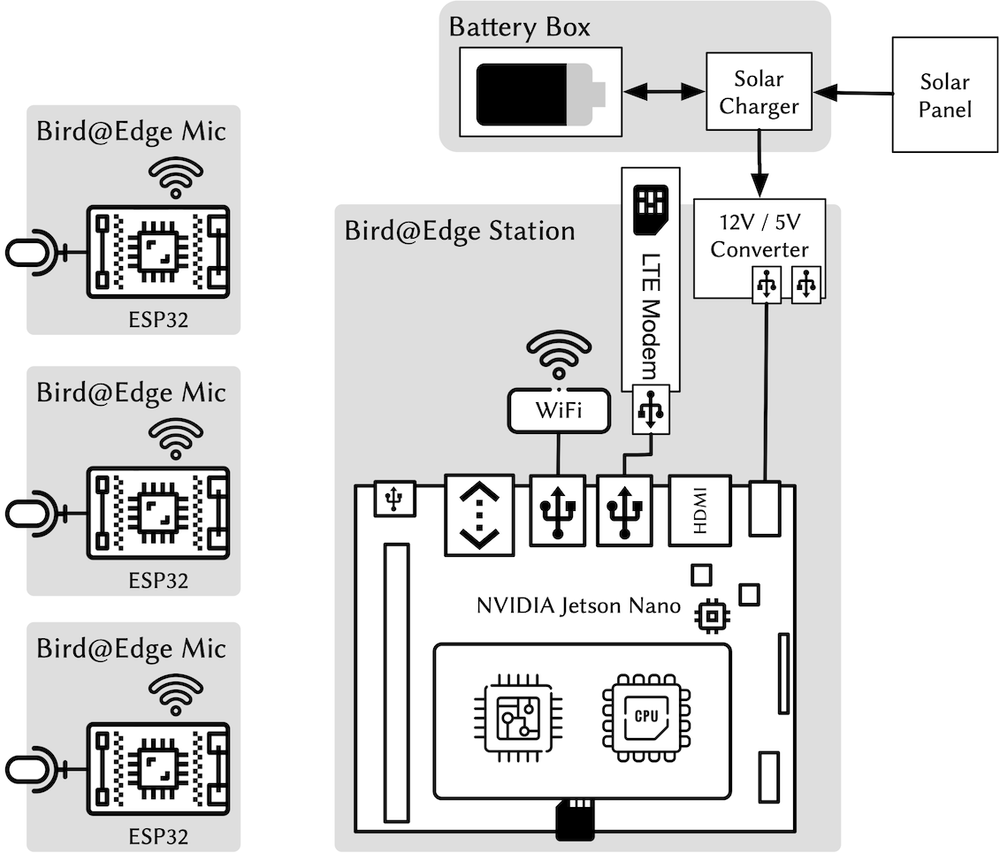

# Bird@Edge OS

Bird@Edge OS is the operating system running on Bird@Edge Stations which is based on NVIDIA Jetson Nano board. This repository holds configuration files and recipes for creating the Bird@Edge OS image.

## Bird Song Recognition at the Edge

Bird@Edge is an Edge AI system for recognizing bird species in audio recordings to support real-time biodiversity monitoring. Bird@Edge is based on embedded edge devices operating in a distributed system to enable efficient, continuous evaluation of soundscapes recorded in forests. If you are interested in our research, [read our paper](https://jonashoechst.de/assets/papers/hoechst2022birdedge.pdf) or watch the talk recorded for [Springer NETYS 2022 conference](https://www.youtube.com/watch?v=reAm4HSyQl8). 

Separate repositories exist for the [machine learning approach](https://github.com/umr-ds/BirdEdge) and for the code running on [Bird@Edge Mic](https://github.com/umr-ds/BirdEdge-Mic).

## Hardware

Our hardware consists of an NVIDIA Jetson Nano device (both the regular and 2 GB variant), a power supply and network connectivity through WiFi and LTE.



## Building Bird@Edge OS

Bird@Edge OS is built using [pimod](https://github.com/Nature40/pimod), a tool reconfiguring Single Board Computer System images with an easy, Docker-like configuration file.

### Prerequisites

- Install [docker](https://docs.docker.com/get-docker/) and [docker-compose](https://docs.docker.com/compose/install/). 
- Checkout this repository, as well as its submodules

```
git clone git@github.com:umr-ds/BirdAtEdge-OS.git
cd BirdAtEdge-OS
git submodule update --init
```

### Build Bird@Edge OS Image

To build your Bird@Edge OS image, follow these steps: 

> Note: Jetson Nano and Jetson Nano 2GB are different and require different base images. **In this example the Jetson Nano is used.** 

- Run the Base Pifile. It will download the standard image from NVIDIAs server and install deepstream:

```
docker-compose run --rm pimod pimod.sh --host-resolv Base-Nano.Pifile
```

- Run the BirdAtEdge Pifile. It will compile and install the custom software, services and configuration files. 

```bash
docker-compose run --rm pimod pimod.sh --host-resolv BirdAtEdge-Nano.Pifile
```

### Flash your image & Setup Jetson Nano

The resulting operating system image now needs to be written to an SD card just as it would be done with any other OS image. You may [refer to NVIDIAs manual](https://developer.nvidia.com/embedded/learn/get-started-jetson-nano-devkit#write).

To setup your Bird@Edge Station the regular [Setup and First Boot](https://developer.nvidia.com/embedded/learn/get-started-jetson-nano-devkit#setup) procedure is required. Please use the headless mode, as the graphical interface is disabled in order to save power. 

### Running Bird@Edge OS

The service running Bird@Edge can be controlled using systemd, i.e. restarting:

```bash
$ systemctl restart birdedge
```

Logs can be investigated using `journalctl`:

```bash
$ journalctl -fu birdedge
Mär 11 15:29:45 pollux systemd[1]: Started BirdEdge.
Mär 11 15:29:49 pollux bash[32515]: INFO:root:Starting BirdEdge Daemon
Mär 11 15:29:49 pollux bash[32515]: DEBUG:asyncio:Using selector: EpollSelector
Mär 11 15:29:49 pollux bash[32515]: DEBUG:root:Discovered ServiceInfo(type='_birdedge._tcp.local.', name='birdclient-f880._birdedge._tcp.local.', addresses=[b'\n*\x00\xb7'], port=80, weight=0, priority=0, server='birdclient-f880.local.', properties={}, interface_index=None)
Mär 11 15:29:49 pollux bash[32515]: DEBUG:root:Discovered ServiceInfo(type='_birdedge._tcp.local.', name='birdclient-4c60._birdedge._tcp.local.', addresses=[b'\n*\x00\xf8'], port=80, weight=0, priority=0, server='birdclient-4c60.local.', properties={}, interface_index=None)
Mär 11 15:29:49 pollux bash[32515]: DEBUG:root:Discovered ServiceInfo(type='_birdedge._tcp.local.', name='birdclient-7885._birdedge._tcp.local.', addresses=[b'\n*\x00\xf0'], port=80, weight=0, priority=0, server='birdclient-7885.local.', properties={}, interface_index=None)
Mär 11 15:29:50 pollux bash[32515]: DEBUG:root:Discovered ServiceInfo(type='_birdedge._tcp.local.', name='birdclient-14f1._birdedge._tcp.local.', addresses=[b'\n*\x00\xf4'], port=80, weight=0, priority=0, server='birdclient-14f1.local.', properties={}, interface_index=None)
Mär 11 15:29:50 pollux bash[32515]: DEBUG:root:Discovered ServiceInfo(type='_birdedge._tcp.local.', name='birdclient-f4b6._birdedge._tcp.local.', addresses=[b'\n*\x00\xf5'], port=80, weight=0, priority=0, server='birdclient-f4b6.local.', properties={}, interface_index=None)
Mär 11 15:29:54 pollux bash[32515]: DEBUG:root:Writing config and running classification process.
Mär 11 15:29:54 pollux bash[32515]: DEBUG:root:Writing config to configs/dynamic.conf
Mär 11 15:30:07 pollux bash[32515]: INFO:root:max_fps_dur 8.33333e+06 min_fps_dur 2e+08
Mär 11 15:30:07 pollux bash[32515]: INFO:root:[Implicit Engine Info]: layers num: 2
Mär 11 15:30:07 pollux bash[32515]: INFO:root:0   INPUT  kFLOAT input_1:0       1x456x128
Mär 11 15:30:07 pollux bash[32515]: INFO:root:1   OUTPUT kFLOAT activation      83
Mär 11 15:30:07 pollux bash[32515]: INFO:root:** INFO: <bus_callback:137>: Pipeline ready
Mär 11 15:30:08 pollux bash[32515]: INFO:root:** INFO: <bus_callback:123>: Pipeline running
Mär 11 15:30:08 pollux bash[32515]: INFO:root:max_fps_dur 8.33333e+06 min_fps_dur 2e+08
Mär 11 15:30:21 pollux bash[32515]: DEBUG:root:Publishing {'measurement': 'birdedge', 'tags': {'station': 'birdclient-f4b6.local.', 'label': 'Waldohreule'}, 'fields': {'confidence': 0.895448}, 'time': 1647009013132714000}
```

## Scientific Usage & Citation

If you are using Bird@Edge in academia, we'd appreciate if you cited our [scientific research paper](https://jonashoechst.de/assets/papers/hoechst2022birdedge.pdf). Please cite as "Höchst & Bellafkir et al."

> J. Höchst, H. Bellafkir, P. Lampe, M. Vogelbacher, M. Mühling, D. Schneider, K. Lindner, S. Rösner, D. G. Schabo, N. Farwig, and B. Freisleben, "Bird@Edge: Bird Species Recognition at the Edge," in *International Conference on Networked Systems (NETYS)*, 2022. DOI: [10.1007/978-3-031-17436-0_6](https://dx.doi.org/10.1007/978-3-031-17436-0_6)

```bibtex
@inproceedings{hoechst2022birdedge,
  title = {{Bird@Edge: Bird Species Recognition at the Edge}},
  author = {H{\"o}chst, Jonas and Bellafkir, Hicham and Lampe, Patrick and Vogelbacher, Markus and M{\"u}hling, Markus and Schneider, Daniel and Lindner, Kim and R{\"o}sner, Sascha and Schabo, Dana G. and Farwig, Nina and Freisleben, Bernd},
  booktitle = {International Conference on Networked Systems (NETYS)},
  year = {2022},
  month = may,
  organization = {Springer},
  keywords = {Bird Species Recognition, Edge Computing, Passive Acoustic Monitoring, Biodiversity},
  doi = {10.1007/978-3-031-17436-0_6},
}
```
